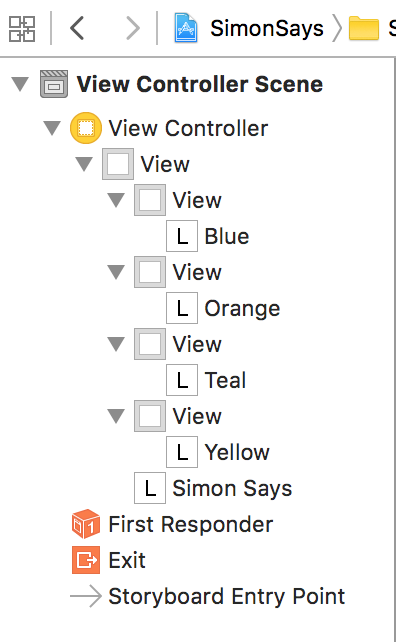

# Interface Builder: Basics

> In theory, there is no difference between theory and practice. But in practice, there is.

## Learning Objectives - The student should be able to...

* Feel comfortable with working with the various aspects of Interface Builder.

## What the student can do at this point 

* Has a general overview of Xcode and is able to create a new project.
* Knows where to locate the testing file within Xcode.
* Knows how to navigate to Interface Builder.
* Knows what a storyboard file is.
* Has a brief overview of what the Object Library is.
* Can drag a View Controller onto the canvas.
* Can locate and drag items from the Object Library.
* Can locate the Attributes Inspector and change the Background color of Views

## Simon Says: Make an App

Now that you've learned how to get around Interface Builder, it's time to make your own app! Or, at least, the user interface for one. In this lab, you'll be laying out the graphical user interface for a Simon app. If you're not a child of the 80s and aren't familiar with Simon, here's the gist: Simon was an electronic game consisting of a disc with four buttons. Each button was a different color. The toy would randomly light up buttons in a random sequence, and then the player had to press the buttons in the same sequence. Sounds exciting, right? Not really, but there wasn't much else to do in the 80s except play Simon and watch He-Man! If you want the full run-down on the game, check out the [Simon](https://en.wikipedia.org/wiki/Simon_\(game\)) article on Wikipedia.

Simon is a pretty simple game, but at this point you may be thinking, "I can't write my own Simon game yet!" Well, maybe not _yet_, but you _will_ be able to soon. At any rate, for this lab, you're just going to be laying out the user interface—and that's something you know how to do!

Here's what you're going to build in this lab:

That might look a little bit daunting, but the interface is completely made up of view components you've already seen and used in previous lessons. Can you identify the views used in this graphical interface? Hint: There are 10 of them!

Think for a minute...

Really look at the interface...

Did you find all 10? Here are the 10 views used in the interface:

1. Grey background (a `UIView`)
2. **Simon Says** label (a `UILabel`)
3. A blue square (a `UIView`)
4. An orange square (a `UIView`)
5. A teal square (a `UIView`)
6. A yellow square (a `UIView`)
7. A **Blue** label (a `UILabel`)
8. An **Orange** label (a `UILabel`)
9. A **Teal** label** (a `UILabel`)
10. A **Yellow** label (a `UILabel`)

That's it! Not so complicated, is it? Let's walk through the creation of this app piece by piece. By the time you're done, you'll have something that looks like the above screenshot.

1. Create a new Xcode project. (Hint: Use the **Single View Application** template from the iOS section.) You can call it **SimonSays**, or whatever you want.
2. Select `Main.storyboard` in the file listing to show the main storyboard in Interface Builder's canvas.
3. Start by adding a new view controller to the storyboard. This will be your main view.
4. Add the blue square to the top left corner of the main view. Remember, this is an instance of a `UIView`. You can find a `UIView` in the object library. Drag it onto the main view you just created in Step 3. Resize it so it only takes up one corner of the screen, and use the Attributes Inspector to change its background color to blue.
5. Create an orange square in the top right corner of the main view. You can add this in the same way you added the blue square in Step 4. Don't forget to set its background color to orange!
6. Now add the teal square to the bottom left corner.
7. Finish off the squares by creating a yellow square in the bottom right corner.
8. Now it's time to label the squares. Drag a new label from the object library to the blue square. (Remember, you can filter components using the search box at the bottom of the object library.) Change its text to **Blue**. (Hint: You can change a label's text by double-clicking on it and typing in new text.) Change the text color to blue. (Hint: You can change the text color in the Attributes Inspector. Bring up the Attributes Inspector, and look for the option marked **Color**, above the **Font** option.)
9. Add an **Orange** label to the orange square. Don't forget to make its text color blue, too!
10. Add a **Teal** label to the teal square.
11. Add a *Yellow** label to the yellow square.
12. You're almost done! One more label to add: Drag a new label to the center of the main view. Change its text to **Simon Says**. You can leave its color as black (or you can change it if you're feeling adventurous).
13. Your interface should look pretty close to the example above. One problem: The background is white, not grey. Change the background so it is grey. (Hint: Select the main view. Bring up its Attribute Inspector, and change **Background Color** to be grey.)
14. Just one more thing: Set your view controller to the _initial view controller_. Remember: You can set this in the Attributes Inspector.

And you're done! Take a look at the object listing (you do remember where that is, don't you?). It should look like this:

You can build and run your application in the simulator to see what it looks like. It doesn't do anything yet, but you've now successfully laid out a graphical interface using Interface Builder, and that's half the battle!

<a href='https://learn.co/lessons/InterfaceBuilderLab' data-visibility='hidden'>View this lesson on Learn.co</a>